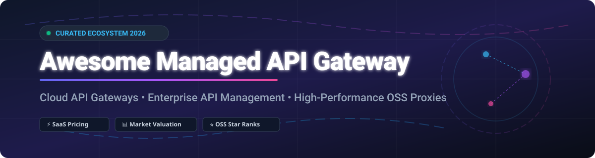

# Awesome-Managed-API-Gateway 🚀

  

## 🌐 Top Managed API Gateway Ecosystem & Cloud API Management 🌐

**Curated List of SaaS Products, Cloud Gateways & High-Performance Open-Source GitHub Projects** ⚡  

*Focused on Managed API Gateways, Self-Hosted Proxies, Service Meshes & Enterprise API Management*  

**Last updated: October 2026** 📅

This repository tracks notable **commercial managed API gateway platforms**, **cloud-native proxy solutions**, and **open-source projects** that route, secure, monitor, rate-limit, transform, and monetize API traffic — from fully managed cloud gateways to self-hosted enterprise proxies, service meshes, and developer portals. 🛡️

---

## 📑 Table of Contents

- [📊 SaaS & Managed Cloud Platforms](#-saas--managed-cloud-platforms)
- [⚡ Open-Source GitHub Projects](#-open-source-github-projects)
  - [🛡️ API Gateways & Reverse Proxies](#️-api-gateways--reverse-proxies)
  - [⚙️ Full API Management Platforms](#️-full-api-management-platforms)
  - [🕸️ Service Mesh as Gateway](#️-service-mesh-as-gateway)
  - [🧰 Additional Popular Open-Source Gateways & Frameworks](#-additional-popular-open-source-gateways--frameworks)
- [📈 Star History](#-star-history)
- [💖 Support & Sponsorship](#-support--sponsorship)
- [🤝 How to Contribute](#-how-to-contribute)
- [⚠️ Disclaimer](#️-disclaimer)

---

## 📊 SaaS & Managed Cloud Platforms

> **Market Insights & Industry Dynamics** 💡  
> The global API Gateway and API Management market size is estimated at **$6.8 Billion - $8.2 Billion in 2026** (projected to reach over $14 Billion by 2030 at a ~20% CAGR).  
> **Market Structure:** The sector is **moderately fragmented**. Mega-cloud vendors (AWS, Google Apigee, Microsoft Azure) and established infrastructure providers (Salesforce MuleSoft, Kong) dominate large enterprise workloads, while agile serverless and edge-first platforms (Zuplo, Traefik Hub, Tyk Cloud) aggressively capture modern developer-led and cloud-native startups.

| Product / Platform | Company Valuation / Revenue | Starting Paid Tier Pricing | Free Tier / Trial Limit | Key Focus & Strengths |
| :--- | :--- | :--- | :--- | :--- |
| **[Amazon API Gateway](https://aws.amazon.com/api-gateway/)** ☁️ | **AWS Revenue: ~$105B+ / year** (Parent Amazon Valuation: ~$2.1 Trillion) | $1.00 per million HTTP requests ($3.50/M REST requests) + data transfer fees | Free Tier: 1 Million HTTP/REST calls & 1 Million WebSocket messages per month for 12 months | AWS-native fully managed gateway with direct IAM, Lambda, and ECS integration. |
| **[Azure API Management](https://azure.microsoft.com/en-us/products/api-management/)** 🔷 | **Microsoft Azure Revenue: ~$75B+ / year** (Parent Microsoft Valuation: ~$3.1 Trillion) | $48.04 / unit / month (Developer Tier) or Consumption tier starting at $3.50 per 1 million calls | Consumption Free Tier: First 1 Million calls per month included per Azure subscription | Enterprise Microsoft cloud integration, native Azure Active Directory & developer portal. |
| **[Apigee](https://cloud.google.com/apigee)** 🟡 | **Google Cloud Revenue: ~$45B+ / year** (Parent Alphabet Valuation: ~$2.0 Trillion) | Pay-as-you-go starting at $300 / environment / month + usage evaluation | Evaluation Tier: $300 free Google Cloud credits for a 90-day trial period | Enterprise full-lifecycle API management, advanced analytics, and monetization governance. |
| **[MuleSoft Anypoint](https://www.mulesoft.com/)** 🔗 | **Salesforce Integration Segment: ~$4.2B / year** (Parent Salesforce Valuation: ~$260 Billion) | Enterprise contract pricing starting from ~$27,000 / year (Pay-as-you-go flexibility) | 30-Day Free Trial (full access to Anypoint Platform & CloudHub gateway) | API-led connectivity, legacy enterprise integration, and unified Anypoint Exchange. |
| **[Postman](https://www.postman.com/)** 📬 | **Valuation: ~$5.6 Billion** (Est. ARR: ~$150M+) | $14 / user / month (Basic) or $29 / user / month (Professional) | Free Forever Plan: Up to 3 team members with 1,000 API monitoring calls/month | Comprehensive API development environment with API client, docs, monitoring & gateway options. |
| **[Kong Konnect](https://konghq.com/products/kong-konnect)** 🦍 | **Valuation: ~$2.0 Billion** (Est. ARR: ~$100M+) | $250 / month (Plus plan) with pay-as-you-go control plane scaling | Free Forever Plan: 1 Control Plane, 3 services, & up to 1 Million requests/month | SaaS control plane for Kong OSS/Enterprise with hybrid cloud deployment & AI Gateway tools. |
| **[Traefik Hub](https://traefik.io/traefik-hub/)** 🚀 | **Traefik Labs Raised: ~$37 Million** (Est. Valuation: ~$200M+) | $49 / month (Pro tier for up to 10 services) | Free Forever Plan: Up to 3 services & 1,000 requests/day | Kubernetes-native API management, GitOps workflow integration, and dynamic cloud ingress. |
| **[Tyk Cloud](https://tyk.io/cloud/)** 🗝️ | **Bootstrap/Private Funded** (Est. ARR: ~$20M - $30M) | $60 / month (Launch plan for dedicated hybrid gateway instances) | 14-Day Free Trial (full feature access without credit card) | Managed Tyk API control plane supporting REST, GraphQL, gRPC, TCP, and UDP traffic. |
| **[Gravitee.io](https://www.gravitee.io/)** ⚡ | **Series B Raised: ~$41 Million** (Est. Valuation: ~$150M+) | Enterprise SaaS custom tiers starting at ~$1,000 / month | 14-Day Free Cloud Trial (unlimited access to event-native gateway features) | Event-native API management with native streaming support for Kafka, MQTT, and WebSockets. |
| **[Zuplo](https://zuplo.com/)** ⚡ | **Seed Raised: ~$12 Million+** (Est. Valuation: ~$40M - $60M) | $25 / month (Pro plan) + usage fees | Free Forever Plan: 100,000 requests/month & unlimited edge edge-deployed APIs | Serverless, edge-deployed API gateway with built-in API keys, documentation, and rate limiting. |

---

## ⚡ Open-Source GitHub Projects

### 🛡️ API Gateways & Reverse Proxies

- **[Caddy](https://github.com/caddyserver/caddy)**  🔒  
  **Modern HTTP/2 & HTTP/3 web server and reverse proxy**, Apache-2.0 licensed. **Automatic HTTPS via Let's Encrypt**, modular architecture with dynamic JSON API configuration. **Best for automated security & modern web proxying**.

- **[Traefik](https://github.com/traefik/traefik)**  🚦  
  **Cloud-native application proxy**, MIT licensed. **Automatic service discovery with Kubernetes, Docker, and Consul**. Built-in Let's Encrypt middleware, ingress controller, and API gateway routing. **Best for Kubernetes ingress and cloud-native workloads**.

- **[Kong Gateway (OSS)](https://github.com/Kong/kong)**  🦍  
  **The most widely adopted open-source API gateway**, Apache-2.0 licensed. **Built on NGINX + LuaJIT for ultra-low latency**. Extensive plugin ecosystem with 100+ plugins for auth, rate limiting, and transformations. **The foundation for Kong Konnect**.

- **[Envoy Proxy / Gateway](https://github.com/envoyproxy/envoy)**  🛰️  
  **Cloud-native high-performance edge/service proxy**, Apache-2.0 licensed. **C++ core designed for microservice architectures**, dynamic configuration via xDS APIs. Serves as the underlying engine for Istio, Envoy Gateway, and Contour. **Best for high-scale platform engineering**.

- **[Apache APISIX](https://github.com/apache/apisix)**  ⚡  
  **High-performance dynamic API gateway**, Apache-2.0 licensed. **etcd-backed real-time configuration updates without restarts**. Supports HTTP, gRPC, WebSocket, and MQTT protocols with hot-pluggable Lua/Wasm plugins. **Best for high-throughput microservices**.

- **[OpenResty](https://github.com/openresty/openresty)**  🛠️  
  **Full-fledged web platform incorporating NGINX and LuaJIT**, BSD licensed. Provides the core underlying building block for custom high-performance API gateways (including Kong and APISIX). **Best for custom C/Lua proxy development**.

- **[Tyk Gateway](https://github.com/TykTechnologies/tyk)**  🗝️  
  **Open-source API gateway written in Go**, MPL-2.0 licensed. **Native REST, GraphQL, TCP, and UDP traffic handling**. Built-in rate-limiting, key management, quota tracking, and detailed analytics middleware. **Best for Go-based API management**.

- **[YARP (Yet Another Reverse Proxy)](https://github.com/dotnet/yarp)**  🔷  
  **Toolkit for building high-performance reverse proxy servers in .NET**, MIT licensed by Microsoft. **Customizable routing, load balancing, and header transformations**. **Best for .NET enterprise environments**.

- **[Apache ShenYu](https://github.com/apache/shenyu)**  🐉  
  **Java-native API gateway for microservices**, Apache-2.0 licensed. **Seamless integration with Dubbo, Spring Cloud, gRPC, and Motan**. Provides dynamic routing, rate limiting, and observability. **Best for Java microservices ecosystems**.

- **[KrakenD (Community Edition)](https://github.com/krakend/krakend-ce)**  🦑  
  **Ultra-fast stateless API gateway written in Go**, Apache-2.0 licensed. **Specializes in API composition, response aggregation, and transformation** with zero backend database dependencies. **Best for high-performance API aggregation**.

- **[Easegress](https://github.com/easegress-io/easegress)**  🌊  
  **Cloud-native traffic orchestration system**, Apache-2.0 licensed. **Combines API gateway, service mesh, and resilience patterns (circuit breaker, retry, pipeline execution)**. **Best for complex traffic orchestration**.

- **[Envoy Gateway](https://github.com/envoyproxy/gateway)**  🌉  
  **Official Kubernetes Gateway API implementation based on Envoy**, Apache-2.0 licensed. Provides standard declarative Kubernetes custom resources (CRDs) for managing Envoy proxies. **Best for standard Kubernetes Gateway API implementation**.

---

### ⚙️ Full API Management Platforms

- **[WSO2 API Manager](https://github.com/wso2/product-apim)**  🏢  
  **Enterprise-grade full-lifecycle API management platform**, Apache-2.0 licensed. Includes API Publisher, Developer Portal, API Gateway, and Analytics engine. **Best for end-to-end enterprise API governance**.

- **[Gravitee.io API Management](https://github.com/gravitee-io/gravitee-api-management)**  ⚡  
  **Event-native API management platform**, Apache-2.0 licensed. Provides policy execution, developer portal, and real-time monitoring for both synchronous (REST) and asynchronous (Kafka, MQTT, WebSockets) APIs.

---

### 🕸️ Service Mesh as Gateway

- **[Istio](https://github.com/istio/istio)**  ⛵  
  **The leading enterprise service mesh**, Apache-2.0 licensed. **Istio Ingress & Egress Gateways** provide comprehensive API gateway features alongside mTLS, telemetry, and traffic shifting. **Best for enterprise service mesh deployments**.

- **[Cilium](https://github.com/cilium/cilium)**  🐝  
  **eBPF-based networking, observability, and security**, Apache-2.0 licensed. Features sidecarless service mesh and Cilium Ingress / Gateway API capabilities operating at the Linux kernel level. **Best for high-performance Kubernetes networking**.

- **[Linkerd](https://github.com/linkerd/linkerd2)**  🔬  
  **Lightweight and performant service mesh for Kubernetes**, Apache-2.0 licensed. Built around ultra-fast Rust micro-proxies (`linkerd2-proxy`). **Best for zero-config security and observability**.

- **[Kuma / Kong Mesh](https://github.com/kumahq/kuma)**  🐻  
  **Universal service mesh built on Envoy**, Apache-2.0 licensed (CNCF Sandbox project). Supports multi-zone, multi-cluster Kubernetes and VM environments with native Kong Gateway integration. **Best for multi-cloud multi-platform mesh**.

---

### 🧰 Additional Popular Open-Source Gateways & Frameworks

- **[Spring Cloud Gateway](https://github.com/spring-cloud/spring-cloud-gateway)**  🍃 — API Gateway built on top of Spring Framework 5, Project Reactor, and Spring Boot 2.x for Java developers.
- **[Ocelot](https://github.com/ThreeMammals/Ocelot)**  🐆 — .NET API Gateway designed for microservices architectures running on .NET Core.
- **[Zuul 2](https://github.com/Netflix/zuul)**  🍿 — Netflix's cloud-facing gateway service providing dynamic routing, monitoring, resiliency, and security.
- **[Kong Ingress Controller](https://github.com/Kong/kubernetes-ingress-controller)**  🦍 — Configures Kong Gateway as a Kubernetes Ingress Controller.
- **[HAProxy](https://github.com/haproxy/haproxy)**  ⚖️ — World's fastest and most widely used software load balancer and reverse proxy.
- **[NGINX Open Source](https://github.com/nginx/nginx)**  🟢 — The foundational web server, reverse proxy, load balancer, and HTTP cache.

---

## 📈 Star History

---

## 💖 Support & Sponsorship

If you found this curated list helpful for evaluating API gateways or choosing your cloud infrastructure architecture, please consider supporting the project! ⭐

- 🌟 **Star this repository** to help others discover it!
- 🔀 **Fork it** and contribute your own updates or tools via Pull Request.
- 📢 **Share it** on Twitter/X, LinkedIn, Reddit, or developer forums.
- ☕ **Buy me a coffee / Sponsor**: Support ongoing maintenance on GitHub Sponsors:  
  👉 **[Sponsor @ishandutta2007 on GitHub Sponsors](https://github.com/sponsors/ishandutta2007)** 💖

---

## 🤝 How to Contribute

1. Fork the repo. 🍴
2. Add/edit entries in `README.md` (follow existing table or list formatting). 📝
3. Include: name, link, 1–2 sentence factual description, and clear pricing or Stars_Count tags. 🏷️
4. Submit a Pull Request with a short explanation of your changes. 🚀

---

## ⚠️ Disclaimer

- This is a **community-curated** resource list — not exhaustive and not an official product endorsement.
- API gateways handle mission-critical API traffic, authentication, and data encryption. Self-hosted solutions require proper security hardening, access controls, and compliance monitoring.
- **Protocol Requirements**: Evaluate based on your API protocols — REST, GraphQL, gRPC, WebSocket, Kafka, and MQTT have distinct gateway performance characteristics.
- **License Considerations**: Verify licenses (Apache-2.0, MIT, MPL-2.0, Enterprise dual-license) against your organization's legal policies before deployment.

---

**Made with ❤️ for API engineers, platform architects, and DevOps teams seeking cloud & open-source API gateway sovereignty.**
